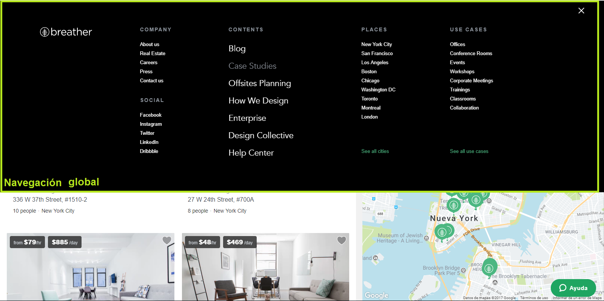
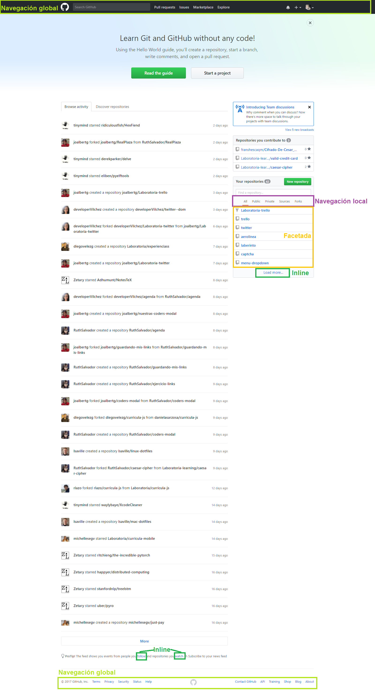
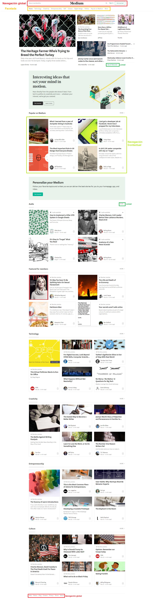

# IDENTIFICANDO ELEMENTOS DE NAVEGACIÓN

Este repositorio se visualizara la identificación de los elementos de navegación en los siguientes sites. **(Breather, Github, Medium)** poniendo en práctica lo aprendido en clases y el self learnig.

### Elementos de navegación:
* Navegación Global
* Navegación Local
* Navegación Facetada
* Navegación Filtrada
* Navegación Contextual
* Navegación Inline
* Navegación Suplementaria

## Breather:

## Github:

## Medium:
